#  HealthOps AI

### AI-Powered Hospital Readmission Prediction and Healthcare Analytics Platform

<p align="center">


<a href="https://healthopsaigurleen.streamlit.app">

</a>
</p>

---

##  Tagline

**HealthOps AI** is an end-to-end intelligent healthcare analytics platform that leverages **Machine Learning**, **SQL Analytics**, **Power BI**, and **Streamlit** to predict **30-day hospital readmission risk**, support clinical decision-making, and provide interactive dashboards for healthcare administrators.

Unlike traditional predictive models, HealthOps AI combines predictive analytics with business intelligence to transform raw healthcare data into actionable insights for doctors, hospitals, and policymakers.

---

#  Table of Contents

- [Project Overview](#-project-overview)
- [Problem Statement](#-problem-statement)
- [Project Workflow](#-project-workflow)
- [Dataset](#-dataset)
- [Exploratory Data Analysis](#-exploratory-data-analysis)
- [Feature Engineering](#-feature-engineering)
- [Machine Learning Pipeline](#-machine-learning-pipeline)
- [Model Performance](#-model-performance)
- [SQL Analytics](#-sql-analytics)
- [Power BI Dashboard](#-power-bi-dashboard)
- [Streamlit Application](#-streamlit-application)
- [Business & Social Applications](#-business--social-applications)
- [Future Scope](#-future-scope)
- [About the Author](#-about-the-author)

---

#  Project Overview

Hospital readmissions remain one of the most significant challenges faced by modern healthcare systems. Patients who return to the hospital shortly after discharge not only increase treatment costs but also indicate potential gaps in discharge planning, follow-up care, or disease management.

HealthOps AI was developed to address this challenge through an integrated healthcare decision-support platform.

The project combines multiple technologies into a single intelligent system:

-  Machine Learning for predicting 30-day readmission risk
-  Power BI for healthcare analytics and KPI monitoring
-  SQL for extracting business insights from hospital data
-  Streamlit for an interactive web application
-  AI-based recommendation system to assist clinicians

Rather than focusing solely on prediction, the platform also emphasizes explainability, visualization, and accessibility, making it suitable for healthcare professionals, hospital administrators, researchers, and policymakers.

---

#  Problem Statement

Hospital readmissions within 30 days of discharge contribute significantly to rising healthcare costs, increased workload on medical staff, and reduced quality of patient care.

Traditional risk assessment approaches rely heavily on manual evaluation and predefined clinical rules, which often fail to capture complex relationships among patient demographics, medical history, hospital characteristics, and treatment outcomes.

Healthcare organizations require an intelligent decision-support system capable of identifying high-risk patients before discharge so that preventive interventions can be implemented.

HealthOps AI addresses this challenge by integrating predictive analytics with interactive healthcare dashboards, enabling data-driven clinical and administrative decision-making.

---

#  Project Workflow

HealthOps AI follows a structured end-to-end data science and analytics workflow, beginning with raw healthcare data and ending with an interactive web application for prediction and decision support.

The project integrates data preprocessing, exploratory analysis, feature engineering, machine learning, SQL analytics, business intelligence dashboards, and a Streamlit-based user interface into a single healthcare analytics platform.

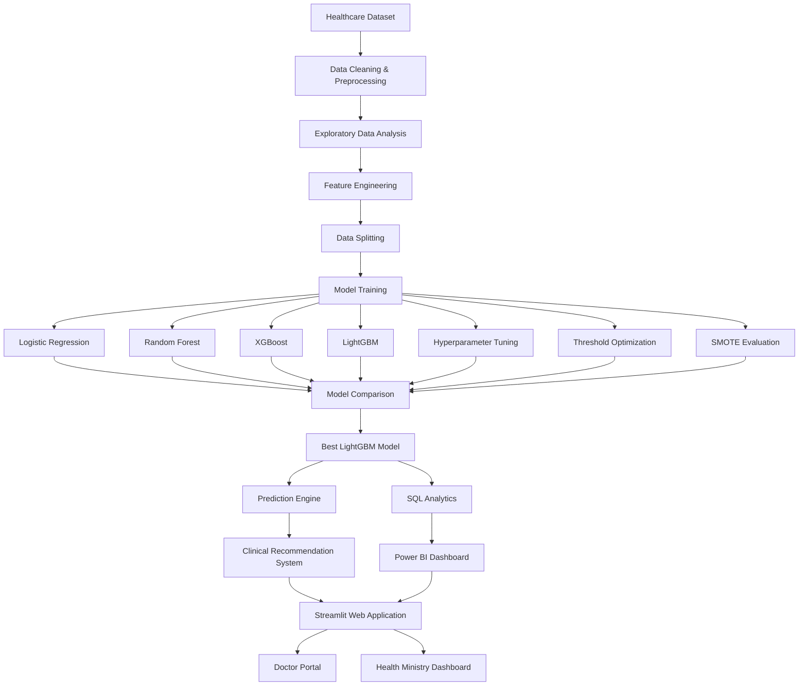

---

## End-to-End Pipeline

```
Healthcare Dataset
        │
        ▼
Data Cleaning
        │
        ▼
Exploratory Data Analysis
        │
        ▼
Feature Engineering
        │
        ▼
Machine Learning
        │
        ▼
Hyperparameter Tuning
        │
        ▼
Threshold Optimization
        │
        ▼
Final LightGBM Model
        │
        ▼
Prediction Engine
        │
        ▼
Recommendation System
        │
        ▼
SQL Analytics
        │
        ▼
Power BI Dashboard
        │
        ▼
Streamlit Deployment
```
---

#  Dataset

**Dataset:** Hospital Readmissions Dataset

**Source:** Kaggle

 **Dataset Link:** *https://www.kaggle.com/datasets/digutlaranjithkumar/india-hospital-readmission-dataset-20152024*

```
https://www.kaggle.com/datasets/digutlaranjithkumar/india-hospital-readmission-dataset-20152024
```

---

##  Dataset Overview

| Property | Value |
|----------|-------|
| Domain | Healthcare |
| Task | Binary Classification |
| Target Variable | `readmitted_30d` |
| Number of Features | 60 |
| Dataset Type | Structured Tabular Data |
| Missing Values | Yes |
| Numerical Features | Yes |
| Categorical Features | Yes |

---

##  Target Variable

The objective of this project is to predict whether a patient will be readmitted within **30 days** after discharge.

| Value | Meaning |
|-------|---------|
| 0 | No Readmission |
| 1 | Readmitted within 30 Days |

This is a **binary classification problem**, where the model estimates the probability of patient readmission.

---

##  Dataset Features

The dataset contains information from multiple aspects of patient care.

###  Patient Information

- Patient ID
- Age
- Gender
- Race
- Marital Status

---

###  Admission Information

- Admission Type
- Admission Source
- Length of Stay
- Admission Date
- Discharge Date

---

###  Clinical Information

- Primary Diagnosis
- Diagnosis Categories
- Diagnosis List
- Number of Diagnoses
- Laboratory Results
- Medical Procedures

---

###  Financial Information

- Insurance Type
- Total Charges
- Hospital Revenue

---

###  Hospital Information

- Hospital ID
- Hospital Name
- Hospital Type
- Hospital Region

---
# Workflow
#  Exploratory Data Analysis (EDA)

The following analyses were performed during the exploratory phase:

- Data overview and summary statistics
- Missing value analysis
- Target variable distribution
- Patient demographic analysis
- Hospital admission analysis
- Diagnosis analysis
- Numerical feature distributions
- Correlation analysis
- Feature relationship exploration

<p align="center">
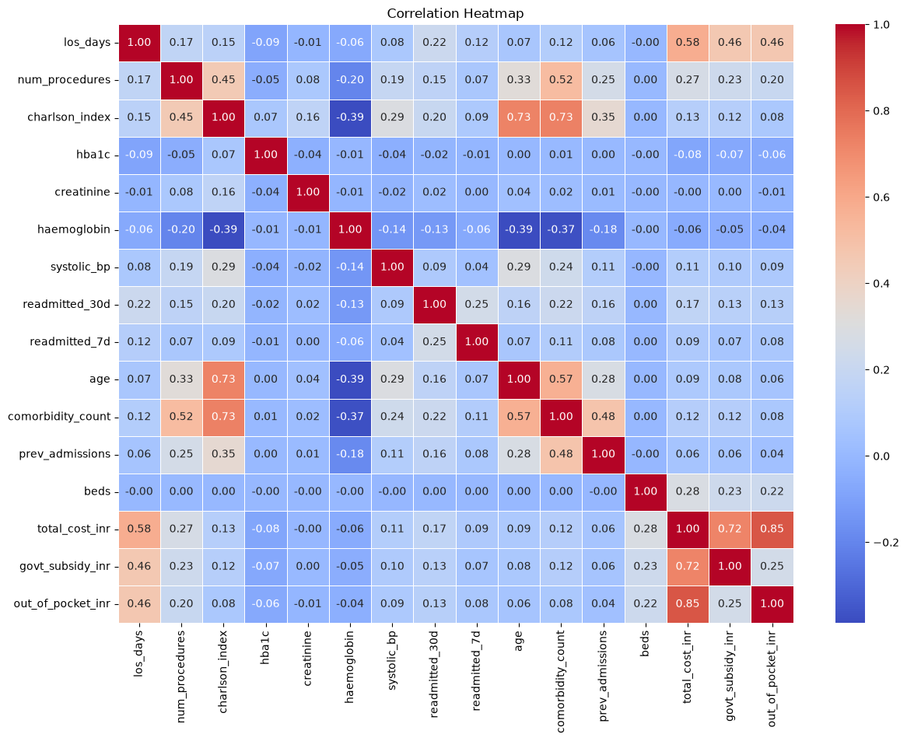
</p>

---

### • Dataset Characteristics

- The dataset consists of both numerical and categorical healthcare attributes.
- Multiple variables required preprocessing due to missing values.
- Patient information, admission details, and diagnosis records contribute significantly to the predictive task.

---

### • Readmission Distribution

- The target variable represents whether a patient was readmitted within 30 days.
- The dataset exhibits **class imbalance**, with non-readmitted patients forming the majority class.
- This imbalance motivated the evaluation of techniques such as class weighting and SMOTE during model development.

---

### • Missing Values

Several features contained missing values.

These were handled during preprocessing using:

- Median imputation for numerical features.
- Most frequent value imputation for categorical features.

---

### • Categorical Features

Healthcare datasets contain numerous categorical variables, including:

- Gender
- Race
- Admission Type
- Insurance Type
- Diagnosis Categories
- Hospital Information

These variables were transformed using **One-Hot Encoding** before model training.

---

### • Numerical Features

Important numerical variables included:

- Age
- Length of Stay
- Number of Procedures
- Number of Medications
- Laboratory Measurements
- Total Charges

These features were standardized using **StandardScaler** to improve model performance.

---

#  Feature Engineering

### Removed Columns

The following identifier and text-based columns were excluded from model training:

- Admission ID
- Patient ID
- Hospital ID
- Hospital Name
- Primary Diagnosis (text)
- Diagnosis List
- Diagnosis Categories

These attributes were removed because they either:

- uniquely identify records,
- contain high-cardinality textual information, or
- do not directly contribute to predictive learning.

---

##  Target Variable

The prediction target used throughout the project is:

```
readmitted_30d
```

| Value | Description |
|-------|-------------|
| 0 | Patient was not readmitted within 30 days |
| 1 | Patient was readmitted within 30 days |

---

##  Train-Test Split

The processed dataset was divided into training and testing subsets.

| Parameter | Value |
|-----------|-------|
| Training Data | 80% |
| Testing Data | 20% |
| Random State | 42 |
| Stratification | Yes |

Stratified sampling was used to preserve the class distribution in both training and testing datasets.

---

##  Numerical Features

Numerical variables were identified automatically based on their data type.

Examples include:

- Age
- Length of Stay
- Total Charges
- Number of Procedures
- Number of Medications
- Laboratory Measurements

### Numerical Processing Pipeline

Each numerical feature underwent the following preprocessing steps:

1. Missing value imputation using the **Median**
2. Standardization using **StandardScaler**

This ensures that all numerical variables have comparable scales, improving model convergence and stability.

---

##  Categorical Features

Categorical variables included patient demographics, hospital information, admission details, insurance, and diagnosis-related attributes.

Examples include:

- Gender
- Race
- Admission Type
- Insurance Type
- Hospital Region
- Diagnosis Categories

### Categorical Processing Pipeline

Categorical variables were processed using:

1. Missing value imputation with the **Most Frequent** category.
2. **One-Hot Encoding** to convert categories into numerical features.

Unknown categories encountered during inference were handled gracefully using:

```
handle_unknown = "ignore"
```

---

##  Preprocessing Pipeline

A reusable preprocessing pipeline was built using **Scikit-learn's Pipeline and ColumnTransformer**.

The pipeline performs all preprocessing steps automatically before model prediction.

### Pipeline Components

- Median Imputation
- Most Frequent Imputation
- Standard Scaling
- One-Hot Encoding
- ColumnTransformer Integration

This approach ensures consistency between training and deployment while reducing the risk of data leakage.

---

##  Feature Engineering Workflow

```text
Raw Dataset
      │
      ▼
Remove Identifier Columns
      │
      ▼
Separate Target Variable
      │
      ▼
Train-Test Split
      │
      ▼
Identify Numerical Features
      │
      ▼
Median Imputation
      │
      ▼
Standard Scaling
      │
      ▼
Identify Categorical Features
      │
      ▼
Most Frequent Imputation
      │
      ▼
One-Hot Encoding
      │
      ▼
Column Transformer
      │
      ▼
Processed Feature Matrix
```

---
#  Machine Learning Pipeline

 The primary objective of this project is to predict whether a patient will be **readmitted within 30 days** after hospital discharge.
---

##  Machine Learning Workflow

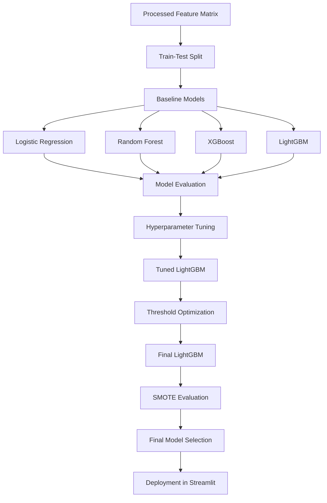

---

#  Machine Learning Models

Several supervised machine learning algorithms were evaluated to determine the most suitable model for predicting hospital readmissions.

---

## 1️ Logistic Regression

Logistic Regression was used as the baseline model for binary classification.

### Characteristics

- Linear Classification Model
- Fast Training
- Highly Interpretable
- Suitable as a Performance Baseline

---

## 2️ Random Forest

Random Forest is an ensemble learning algorithm that combines multiple decision trees to improve prediction accuracy and reduce overfitting.

### Characteristics

- Ensemble Method
- Robust to Noise
- Handles Non-linear Relationships
- Performs Automatic Feature Selection

---

## 3️ XGBoost

Extreme Gradient Boosting (XGBoost) is a highly efficient gradient boosting algorithm capable of learning complex relationships within structured healthcare data.

### Characteristics

- Gradient Boosting
- High Predictive Power
- Regularization
- Efficient Tree Pruning

---

## 4 LightGBM

LightGBM is a histogram-based gradient boosting framework optimized for speed and scalability.

### Advantages

- Faster Training
- Lower Memory Usage
- Handles Large Feature Spaces
- Excellent Performance on Tabular Data

---

#  Hyperparameter Tuning

To further improve prediction performance, LightGBM was optimized using **RandomizedSearchCV**.

### Optimization Strategy

- Randomized Search
- 5-Fold Stratified Cross Validation
- F1 Score as Optimization Metric

### Parameters Tuned

- Number of Trees
- Learning Rate
- Maximum Depth
- Number of Leaves
- Minimum Child Samples
- Feature Sampling
- Row Sampling
- Regularization Parameters
- Scale Positive Weight

Hyperparameter tuning significantly improved the model's ability to identify high-risk patients while maintaining good generalization.

---

#  Threshold Optimization

The default decision threshold of **0.50** is not always optimal for imbalanced healthcare datasets.

Instead of directly using the default threshold, multiple threshold values were evaluated to maximize the **F1 Score**, providing a better balance between Precision and Recall.

The optimal threshold was selected based on the highest F1 Score observed on the testing dataset.

---

## Threshold Optimization Result

<p align="center">
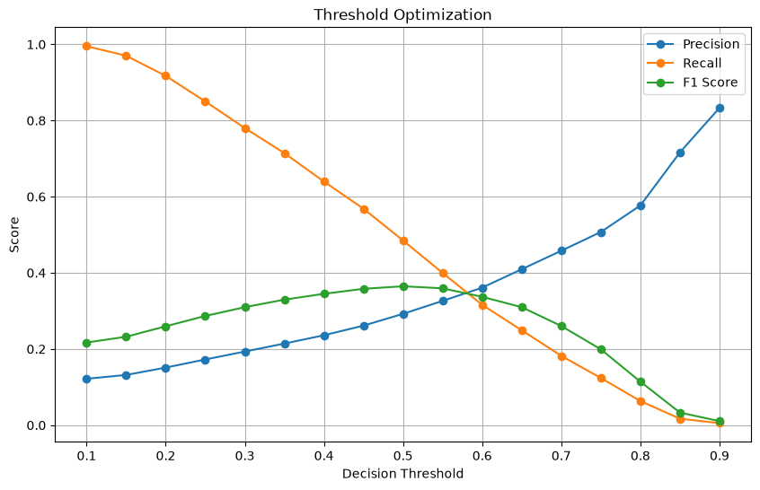
</p>

---

#  Handling Class Imbalance

The hospital readmission dataset exhibited class imbalance, where the majority of patients were not readmitted.

To investigate whether balancing the dataset could improve predictive performance, the **Synthetic Minority Oversampling Technique (SMOTE)** was evaluated.

SMOTE generates synthetic minority class samples, allowing the model to learn a more balanced decision boundary.

The performance of **LightGBM + SMOTE** was compared against the original LightGBM model.

---

#  Model Performance Evaluation

Each model was evaluated using multiple performance metrics to ensure a comprehensive assessment.

### Evaluation Metrics

- Accuracy
- Precision
- Recall
- F1 Score
- ROC-AUC Score
- Confusion Matrix
- Classification Report

---

#  Model Comparison

The performance of all implemented machine learning models is summarized below.

<p align="center">
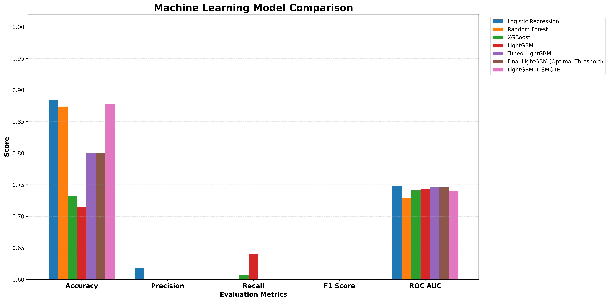
</p>

---

#  Performance Heatmap

A heatmap was created to compare model performance across multiple evaluation metrics.

<p align="center">
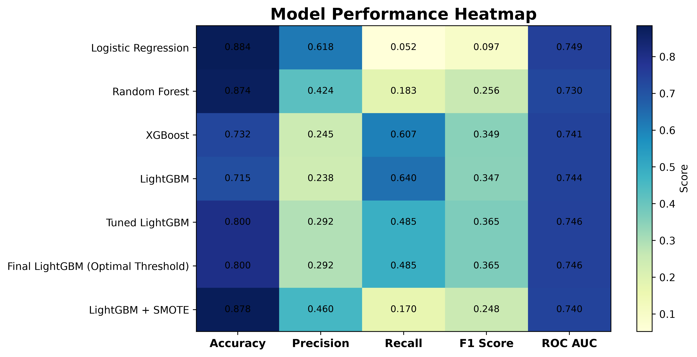
</p>

---

#  Final Model Selection

After extensive experimentation, **Tuned LightGBM with Optimal Threshold** was selected as the final deployment model.

### Reasons for Selection

- Highest overall predictive performance
- Excellent balance between Precision and Recall
- Improved F1 Score
- Strong ROC-AUC performance
- Better identification of high-risk patients
- Suitable for deployment in healthcare decision-support systems

The selected model was exported using **Joblib** and integrated into the Streamlit application for real-time hospital readmission prediction.

---

#  Model Deployment

The final deployed package contains:

- Tuned LightGBM Model
- Scikit-learn Preprocessing Pipeline
- Optimal Decision Threshold

This ensures that every new patient record undergoes identical preprocessing before prediction, maintaining consistency between training and deployment environments.

---
#  SQL Analytics

##  Business Questions Addressed

The SQL queries were designed to answer questions such as:

- Which hospitals admit the highest number of patients?
- What are the most common diagnoses?
- Which age groups experience higher readmission rates?
- What is the average length of hospital stay?
- How are healthcare costs distributed?
- Which insurance providers cover the majority of patients?
- Which hospitals generate the highest revenue?

---

##  SQL Analysis Results

<p align="center">
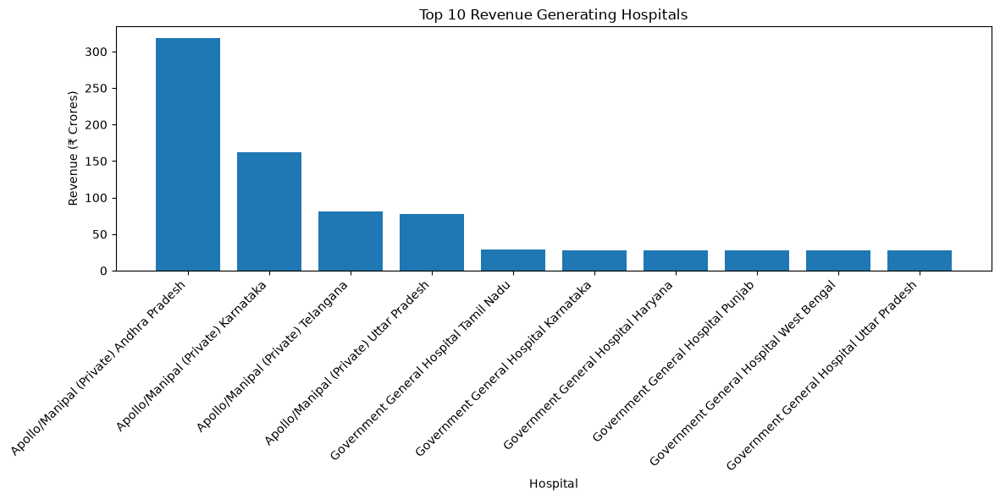
</p>

---

<p align="center">
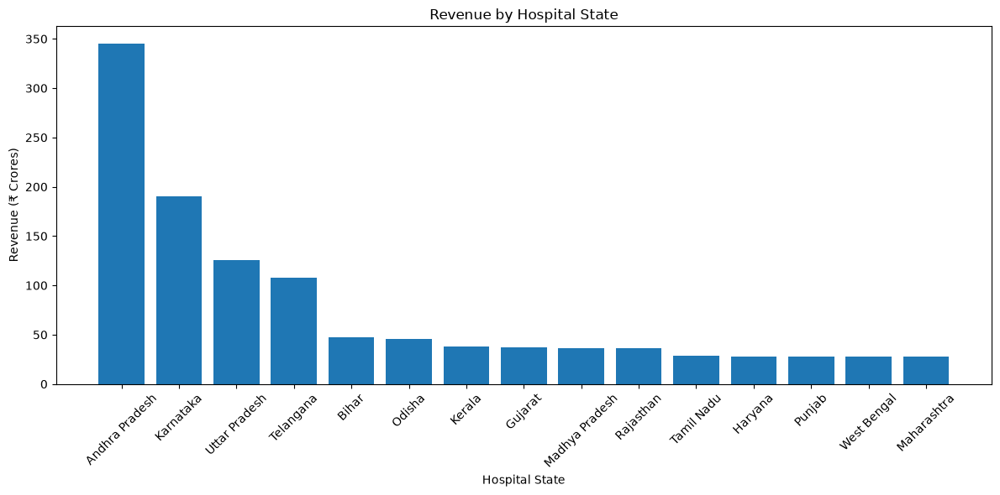
</p>

---

<p align="center">
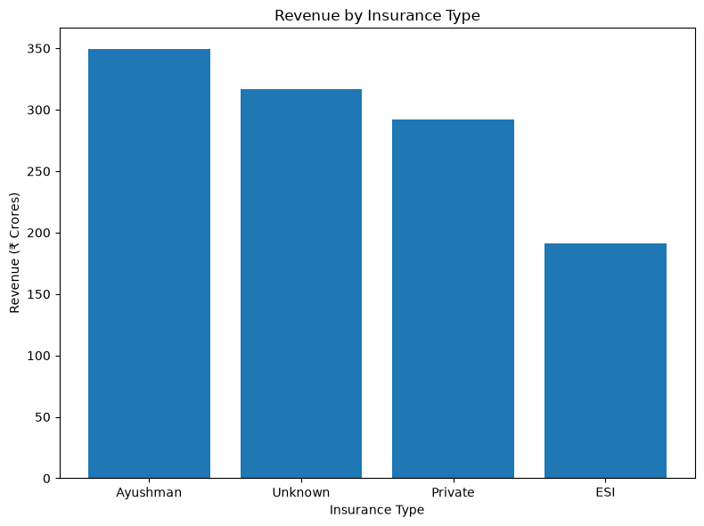
</p>

---

##  Key Insights

The SQL analysis revealed several valuable healthcare insights:

- Hospital admissions vary significantly across hospitals.
- Certain diagnoses contribute disproportionately to patient readmissions.
- Average length of stay differs across patient groups.
- Readmission trends can be monitored using structured healthcare data.
- Financial metrics such as treatment costs and revenue can assist hospital administrators in resource planning.
- Insurance distribution provides insights into healthcare accessibility and reimbursement patterns.

---

#  Power BI Dashboard

##  Dashboard Features

The dashboard includes visualizations for:

-  Readmission Rate
-  Hospital Performance
-  Patient Demographics
-  Financial Analysis
-  Length of Stay
-  Diagnosis Trends
-  Interactive KPIs
-  Dynamic Filtering and Slicers

---

##  Dashboard Screenshots

### Dashboard 1 — Executive Overview

<p align="center">
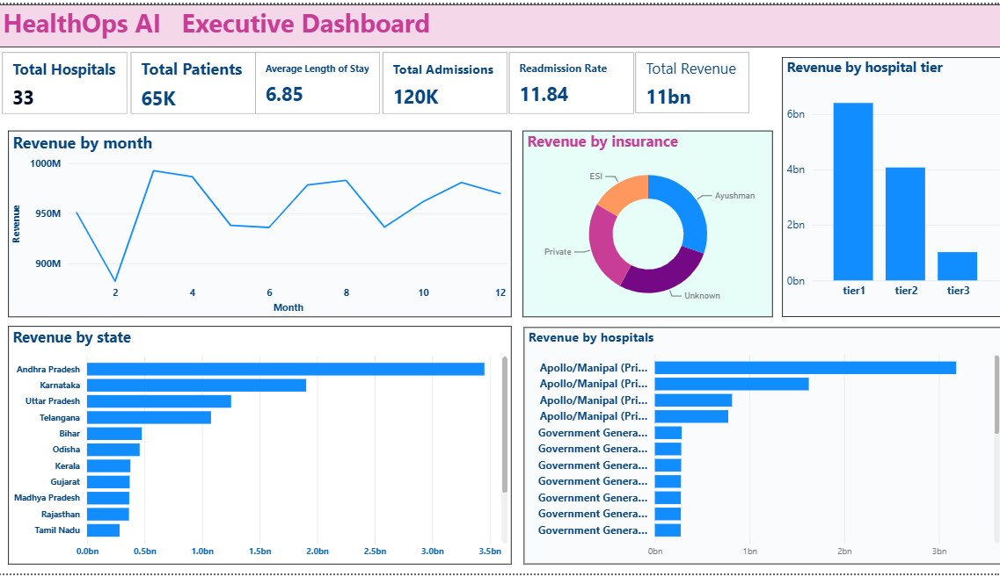
</p>

---

### Dashboard 2 — Hospital Performance Analysis

<p align="center">
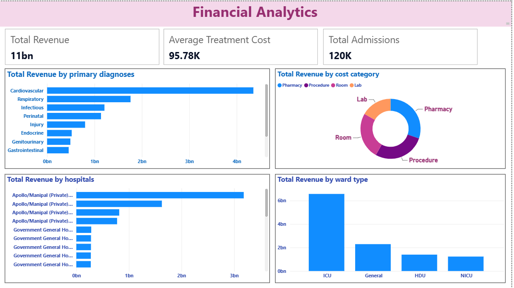
</p>

---

### Dashboard 3 — Patient & Diagnosis Analytics

<p align="center">
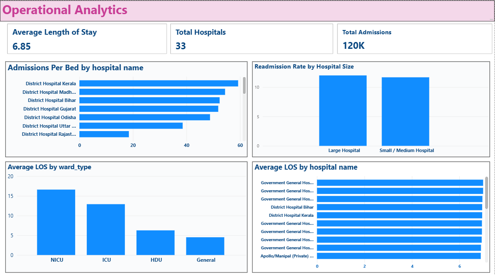
</p>

---

### Dashboard 4 — Financial Analytics

<p align="center">
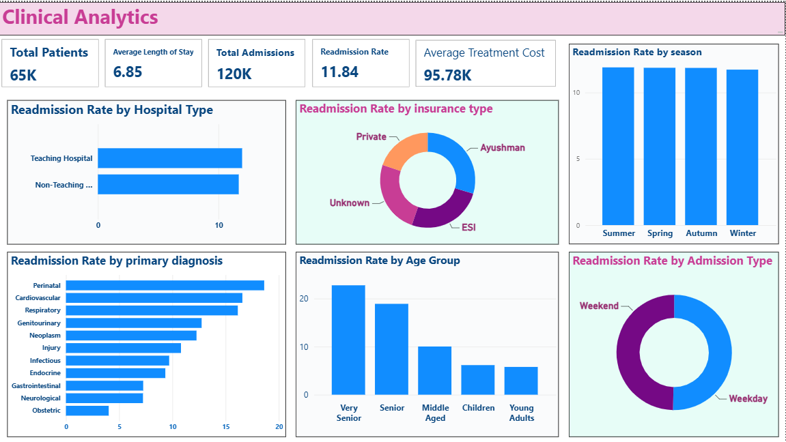
</p>

---

### Dashboard 5 — Operational Insights

<p align="center">
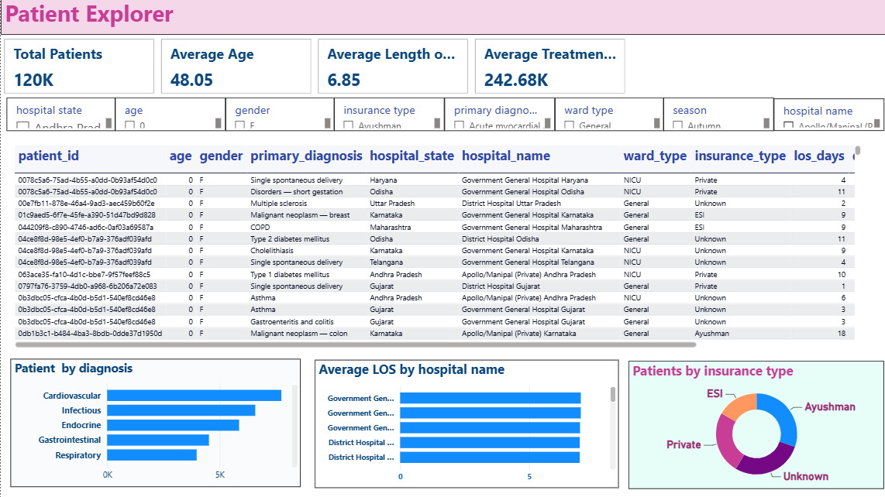
</p>

---

##  Key Performance Indicators (KPIs)

The dashboard monitors several important healthcare KPIs, including:

- Total Patients
- Total Admissions
- Readmission Rate
- Average Length of Stay
- Average Treatment Cost
- Hospital Revenue
- Diagnosis Distribution
- Insurance Distribution

---
#  Streamlit Web Application

### Application Architecture

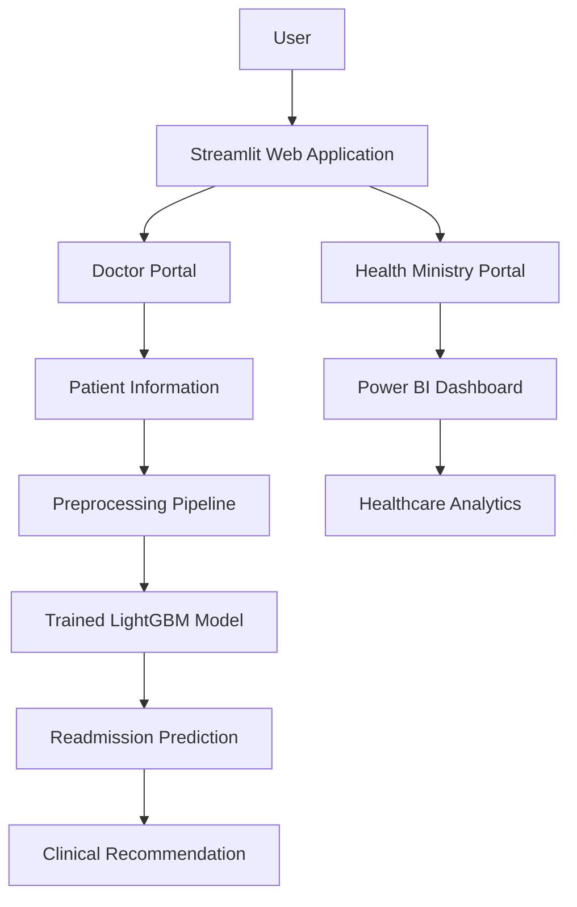

---

#  User Roles
##  Doctor

Doctors can:

- Enter patient information.
- Predict 30-day readmission risk.
- View prediction probability.
- Receive AI-assisted recommendations.
- Support discharge planning and clinical decision-making.

---

##  Health Ministry

The Health Ministry dashboard provides high-level healthcare analytics through Power BI.

Officials can:

- Monitor hospital performance.
- Analyze patient demographics.
- Evaluate readmission trends.
- Track healthcare KPIs.
- Support policy and resource planning.

---

#  Application Workflow

The complete workflow of the deployed application is illustrated below.

```text
User Login
      │
      ▼
Doctor Dashboard
      │
      ▼
Enter Patient Information
      │
      ▼
Feature Preprocessing
      │
      ▼
LightGBM Prediction
      │
      ▼
Readmission Probability
      │
      ▼
Clinical Recommendation
      │
      ▼
Health Ministry Dashboard
      │
      ▼
Power BI Reports
```

---

#  Application Interface

The following screenshot illustrates the Streamlit application.

<p align="center">
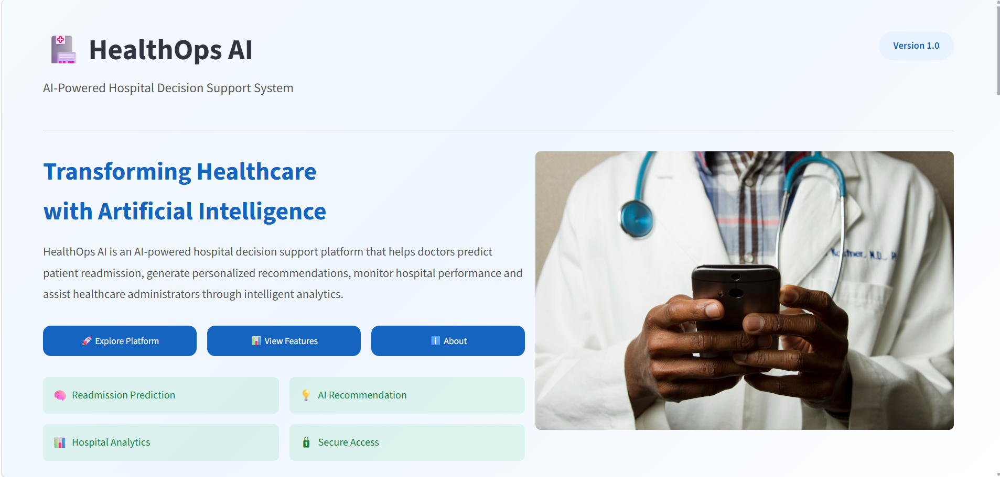
</p>

---

#  Features

The deployed application includes the following features:

###  Home Page

- Project introduction
- Navigation interface
- Feature overview

---

###  Doctor Login

- Secure login interface
- Authentication before prediction

---

###  Doctor Dashboard

- Navigation panel
- Access to prediction system
- Recommendation module

---

###  Patient Readmission Prediction

Doctors can enter patient information including:

- Demographic details
- Admission information
- Clinical characteristics
- Hospital information

The application processes these features through the trained preprocessing pipeline before generating predictions.

---

###  Prediction Results

The deployed LightGBM model predicts:

- Probability of readmission
- Readmission status
- Risk assessment

This prediction helps clinicians identify high-risk patients before discharge.

---

###  Clinical Recommendation System

Based on the predicted risk level, the application provides AI-assisted recommendations to support clinical decision-making.

Example recommendations include:

- Schedule follow-up appointments.
- Monitor high-risk patients closely.
- Improve discharge planning.
- Review medication adherence.
- Recommend lifestyle modifications.

---

###  Health Ministry Dashboard

The Ministry portal provides interactive healthcare analytics powered by Power BI.

Dashboard capabilities include:

- Readmission statistics
- Hospital comparison
- Financial insights
- Patient demographics
- Diagnosis trends
- Operational KPIs

---

#  Technologies Used

The Streamlit application integrates multiple technologies into a single platform.

| Component | Technology |
|------------|------------|
| Web Framework | Streamlit |
| Machine Learning | LightGBM |
| Data Processing | Pandas |
| Preprocessing | Scikit-learn |
| Model Serialization | Joblib |
| Business Intelligence | Power BI |
| Database Analytics | SQL |
| Programming Language | Python |

---

#  Live Demo

You can access the deployed Streamlit application here:

** Live Application:**  
https://healthopsaigurleen.streamlit.app

> **Demo Credentials**

**Doctor Portal**
- Username: `doctor`
- Password: `doctor123`

**Health Ministry Portal**
- Username: `ministry`
- Password: `ministry123`

---

#  Business & Social Applications

## Business Applications

- Hospital readmission prediction
- Clinical decision support
- Healthcare resource planning
- Hospital performance monitoring
- Financial and operational analytics

## Social Impact

- Improve patient care
- Reduce avoidable readmissions
- Support evidence-based decisions
- Enhance healthcare efficiency
- Promote data-driven public health policies

---
#  Future Scope

Potential future enhancements include:

- Integration with Electronic Health Records (EHR)
- Real-time prediction using cloud deployment
- Explainable AI (SHAP/LIME)
- Deep learning model comparison
- Multi-hospital data integration
- Mobile application development
- Secure authentication and role-based access
- Live Power BI dashboard integration

---
#  About the Author

**Developed by:** Gurleen Kaur

Final Year B.Tech (Electronics & Computer Engineering)  
Guru Nanak Dev University, Amritsar

### Skills

- Python
- Machine Learning
- SQL
- Power BI
- Streamlit
- Data Analytics

### Connect With Me

- GitHub: *https://github.com/GurleenKaur00*
- LinkedIn: *https://www.linkedin.com/in/gurleen-kaur-sandhu/*
- Email: *gurleenkaursandhu2210@gmail.com*

---